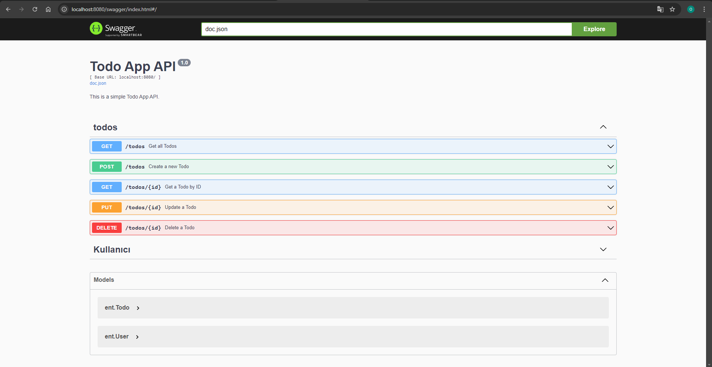

# Todo App



A simple Todo App built with Go, Chi, and Entgo. This app includes user registration, login, and CRUD operations for todos. It also uses Casbin for role-based access control (RBAC).

## Features
- User Registration and Login
- CRUD operations on Todos
- Role-based access control with Casbin
- Swagger API Documentation

## Getting Started

### Prerequisites
- [Go 1.23 or higher](https://golang.org/doc/install)
- [Docker](https://www.docker.com/get-started)

### Installation
 **Clone the repository:**
   ```bash
   git clone https://github.com/yourusername/todo-app-go.git
   cd todo-app-go


Run the application:
terminal->swag init
terminal->docker-compose up --build
terminal->docker-compose up

Swagger Documentation
Once the app is running, you can access the Swagger documentation at:
http://localhost:8080/swagger/index.html

